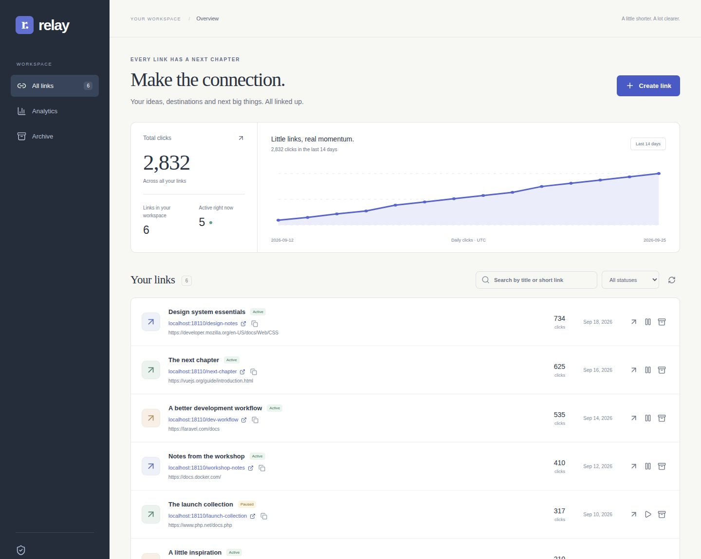
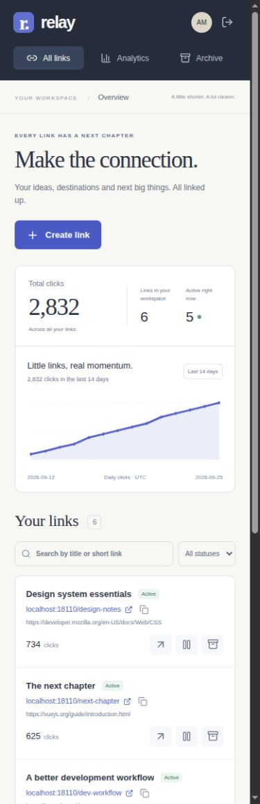
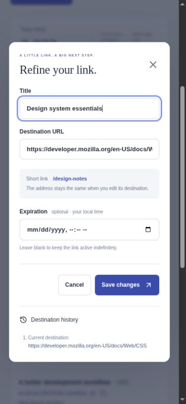

# Relay — a considered home for your links

A link manager built with **Laravel 13, Vue 3 and SQLite**. Create memorable short addresses, change their destinations without breaking the shared link, and see aggregate activity without building visitor profiles.



## Run it locally

Docker with the Compose plugin is the only prerequisite. PHP, Composer, Node and SQLite run inside containers.

```sh
git clone https://github.com/Pablo-Camara/URL-Shortner.git
cd URL-Shortner
./scripts/setup.sh

# Optional: fictional workspace for exploring the interface
docker compose run --rm app php artisan db:seed --class=DemoSeeder
```

Open **[localhost:8090](http://localhost:8090)**. For the demo, sign in with `alex@example.test` / `hello-there-demo`. Otherwise, create your own local account.

The screenshots are from the running application. Demo people, titles and click counts are fictional and generated by `DemoSeeder`; they do not represent real traffic. Seeding refuses an existing users table and any environment other than `local` or `testing`.

Setup installs locked dependencies, generates a missing app key, migrates the database and builds the frontend. Re-running it preserves the existing `.env`, key and database. It never resets or reseeds data. The HTTP port binds to loopback.

| Setting | Default | Purpose |
| --- | --- | --- |
| `APP_URL` | `http://localhost:8090` | Canonical origin used in shared addresses and self-loop validation |
| `APP_PORT` | `8090` | Published local HTTP port |
| `DB_DATABASE` | `/app/database/database.sqlite` | Database path inside the container |
| `REGISTRATION_ENABLED` | `true` in the local example; `false` if unset | Allow new email/password accounts |
| `SESSION_SECURE_COOKIE` | Unset locally | Set `true` behind production HTTPS |

To change the port, copy `.env.example` to `.env` first and change **both** `APP_URL` and `APP_PORT`. For native PHP, change `DB_DATABASE` to an absolute host path. On Linux, direct Compose commands use UID/GID 1000 by default; export `LOCAL_UID=$(id -u)` and `LOCAL_GID=$(id -g)` if needed. Setup handles ownership automatically.

```sh
docker compose logs --tail 100
docker compose down # stops the stack without deleting the SQLite database
```

If Docker's address pools are exhausted, supply an unused subnet through a local Compose override. There is no need to remove other projects' networks.

## What you can do

- Create random or custom aliases with a named destination and optional expiration.
- Edit a destination while keeping its short address and complete destination history.
- Pause, archive and restore links. Archived addresses remain reserved and are never recycled.
- Search by title or alias, filter status and paginate the list.
- Copy short addresses, inspect history and use the same interface on mobile.
- View daily clicks for the last 14 UTC dates and an all-time aggregate.

 

The native dialog supports keyboard focus, Escape and return focus. Forms retain failed drafts; loading, empty, conflict and validation states are explicit. Reduced-motion preferences are respected. Assets and icons are bundled locally.

## How it is structured

```text
Vue components → same-origin session API → form requests + ownership policy
                                        → LinkService → SQLite transactions
Public alias → destination validation → 302 redirect + daily aggregate
```

| Boundary | Responsibility |
| --- | --- |
| `app/Http/Requests/SaveLinkRequest.php` | Input bounds, alias rules, expiration and safe destination validation |
| `app/Policies/ShortlinkPolicy.php` | Owner-only reads and mutations |
| `app/Services/LinkService.php` | Atomic alias allocation, destination history and optimistic concurrency |
| `app/Http/Resources/LinkResource.php` | Explicit API representation, without account internals |
| `app/Http/Controllers/RedirectController.php` | Stateless redirects and anonymous daily counting |
| `resources/js/components/` | Account form, editor, link list and accessible SVG chart |
| `resources/js/lib/api.js` | Cookies, CSRF, structured failures and cancellation |

### Decisions that matter

**Editable destinations use 302 + `no-store`.** A permanent redirect can keep sending a browser to an old destination after an edit. Missing aliases return 404; inactive, expired, invalid or destination-less links return 410.

**The database is the final uniqueness boundary.** Aliases have a unique constraint, and a conditional claim safely handles unused legacy strings. Creation and destination changes are transactional. Random aliases retry collisions. A `version` comparison prevents lost edits; stale updates return 409 and leave newer data untouched.

**Browser sessions are first-class.** HttpOnly cookies, encrypted session handling, CSRF on mutations, session regeneration and rate-limited account endpoints replace the original bearer-token flow. Old personal access tokens cannot authenticate these routes. Each owner sees only their links and aggregates.

**Count clicks, not people.** A successful GET redirect increments one daily counter atomically. Repeat visits and bots can count; HEAD probes do not. No raw IP, referrer, user-agent or visitor identifier is stored by analytics, and redirects issue no cookies. Analytics write failures are reported but do not prevent a valid redirect. Web-server logs are a separate operational concern.

**Only HTTP(S) destinations.** Validation rejects credentials, control characters, spaces, backslashes and the configured service hostname. Legacy destinations are checked again before redirecting. The app does not fetch destination content, resolve previews or make server-side requests to arbitrary URLs. This is not a malware or phishing detector.

**A small deployable unit.** No repository abstraction, background worker or distributed cache is needed for this local scope. SQLite uses WAL and a busy timeout. List queries are eager-loaded and bounded; charts query aggregate rows. A large deployment would need database-specific load tests, retention and capacity planning.

## Verification

```sh
docker compose run --rm app php artisan test --compact
docker compose run --rm app vendor/bin/pint --test
docker compose run --rm node npm test
docker compose run --rm node npm run format:check
docker compose run --rm node npm run build
docker compose run --rm app composer audit
docker compose run --rm node npm audit

# With the optional demo seeded and the stack running (Node 24 on the host):
node scripts/check-http.mjs
```

The backend suite covers authentication, CSRF, rate limits, ownership, alias conflicts, reserved names, unsafe destinations, stale edits, destination history, pause/archive/restore, expiration, redirect headers, cookie-free counting, pagination, aggregate isolation and legacy migrations. Frontend tests cover request boundaries, error handling and draft preservation. The HTTP check exercises real cookies, login, create/edit/history, redirects, analytics, archive and logout. It leaves its verification link archived in the local demo.

GitHub Actions builds the application and runs these checks. Browser QA also covers desktop, 390px and 320px layouts and the main creation/edit/archive flows. Dependency updates are proposed monthly.

## Upgrading the original project

This is a deliberate replacement of the 2022 interface and API, **not a drop-in frontend update**. Git history retains the original implementation.

1. Back up the database, `.env` and application key. Test against a copy first. The bundled Docker setup targets SQLite; an existing MySQL deployment needs its own PHP driver/configuration and staging verification.
2. Preserve the original key and canonical `APP_URL`. Install the locked dependencies and run `php artisan migrate`.
3. The additive migration preserves users, short strings, owners, destination history and status IDs. It refuses duplicate alias assignments or multiple current destinations before changing schema. Resolve ambiguous legacy records explicitly; it does not guess or delete history.
4. Existing registered users with passwords can sign in. Legacy guests and social-only accounts do not have a supported sign-in/recovery path in this version. Arrange an authenticated account migration before adopting this version for those users.
5. Historical action/device/OAuth/permission tables remain intact but are unused. Analytics begins in `daily_clicks`; old event totals are not silently relabeled as new metrics.
6. Review any aliases colliding with application routes such as `/app` and `/api`. Unsafe historical destinations now return 410. Status 2 is shown as archived, and status 3 as paused. Previously cached 301 responses cannot be revoked from a visitor's browser.

The old guest quotas, permission-group administration, five OAuth integrations, CAPTCHA, contact form, email delivery/verification and password recovery are retired from this focused version. Administrators have no implicit access to other owners' links through the application. Legacy API clients require migration to the new contract.

## Deployment limits

The included PHP CLI server is a **local development environment**, not a production web-server configuration. Before opening an instance to the public, use an HTTPS reverse proxy and supported PHP runtime, disable debug mode, configure secure cookies and backups, and decide who may register. A public shortening service also needs an abuse-reporting/moderation process, destination reputation checks and traffic controls. Account recovery and email verification are not implemented. There is no claim of unique-visitor accuracy or perfect bot filtering.

Never commit `.env`, application keys, databases or provider credentials. Older revisions contained apparent OAuth credentials; removing them from the README does not revoke them. Rotate/revoke any historical values that were ever valid.
